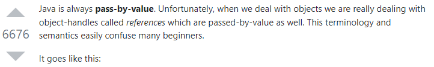

# call by value & call by reference

## call by value

- 말 그대로 call by __value__
- 값을 전달받는 형식
- 전달받은 값을 복사하여 사용
- 전달받은 값의 원본은 변경에 영향 X

## call by reference

- 말 그대로 call by __reference__
- 주소값을 전달받는 형식
- 전달받은 값을 직접 참조하여 사용
- 전달받은 값의 원본도 변경에 영향 O

## 자바는 call by reference 가 없고 call by value 뿐이다?

- 이 md를 작성한 이유
- [leetcode 148](https://github.com/bright-jun/ProblemSolving/blob/master/src/exercise/leetcode/Solution148.java)
  - 이 문제를 풀면서 어떤 경우는 원본에 영향을 주지않고, 어떤 경우는 원본에 영향을 주어서 그 차이점을 고려하면서 문제를 풀어야 했다
  - `int`와 같은 기본형 타입(Primitive Type)값들은 변수선언에 사용한 원본의 값에 영향을 받지 않았지만
  - `Node`과 같은 참조형 타입(Reference type)값들은 변수선언에 사용한 원본의 값에 영향을 받았다
- 위 경우처럼 전달받은 값의 원본도 변경에 영향을 받는 경우가 생긴다
- 자바에서도 C/C++ 과 같이 call by reference를 사용하는 줄 알았는데 아니다
  - 
- 참조형 타입의 주소값이 stack 영역에 생성되며, 이 참조값은 heap 영역의 객체를 바라보고 있게 된다.
  - 즉, 주소값이 같으면 heap 영역의 같은 객체를 바라보고있는게 되므로, 원본의 값에 영향을 받게 된다.
  - 

## 왜 call by value 뿐인지?

> 하지만 자바가 탄생하던 시기의 C, C++와 비교하여 어째서 Call by Value 방식을 채택하였는지 감히 예상해 보자면 두 언어에 공통으로 존재하는 개발자의 주소 제어 권한을 제약하고, JVM을 사용하기 때문에 좀 더 Safety한 작동 방식이 필요했기 때문에 이런 Call by Value 방식을 사용하지 않았나 감히 추측해 봅니다 !
> 
> 출처 : [https://velog.io/@ahnick/Java-Call-by-Value-Call-by-Reference](https://velog.io/@ahnick/Java-Call-by-Value-Call-by-Reference)

## wrapper class 일 때는 어떻게 동작하는지?

- wrapper class를 파라미터로 받아서 swap하면 동작하지 않음.
- wrapper class 는 Heap area에 저장이되는게 아닌건지?
  - [Java_data_type](../java/data_type.md) 참고 

## 참고

- [Java_data_type](../java/data_type.md)
- [https://stackoverflow.com/questions/40480/is-java-pass-by-reference-or-pass-by-value](https://stackoverflow.com/questions/40480/is-java-pass-by-reference-or-pass-by-value)
- [https://moo-on.github.io/java/Call-by-value-and-JVM-memory-structure/](https://moo-on.github.io/java/Call-by-value-and-JVM-memory-structure/)
- [https://deveric.tistory.com/92](https://deveric.tistory.com/92)
- [https://hyoje420.tistory.com/6](https://hyoje420.tistory.com/6)
- [https://velog.io/@ahnick/Java-Call-by-Value-Call-by-Reference](https://velog.io/@ahnick/Java-Call-by-Value-Call-by-Reference)
